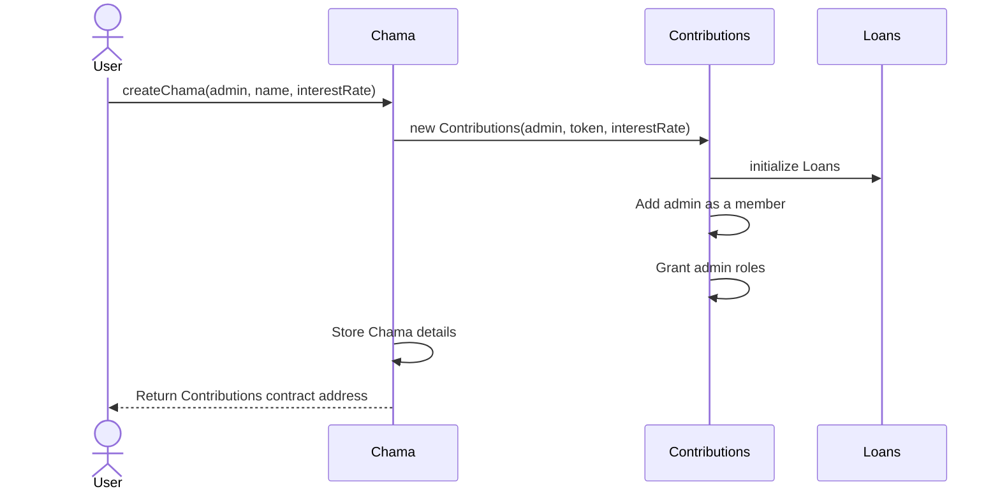
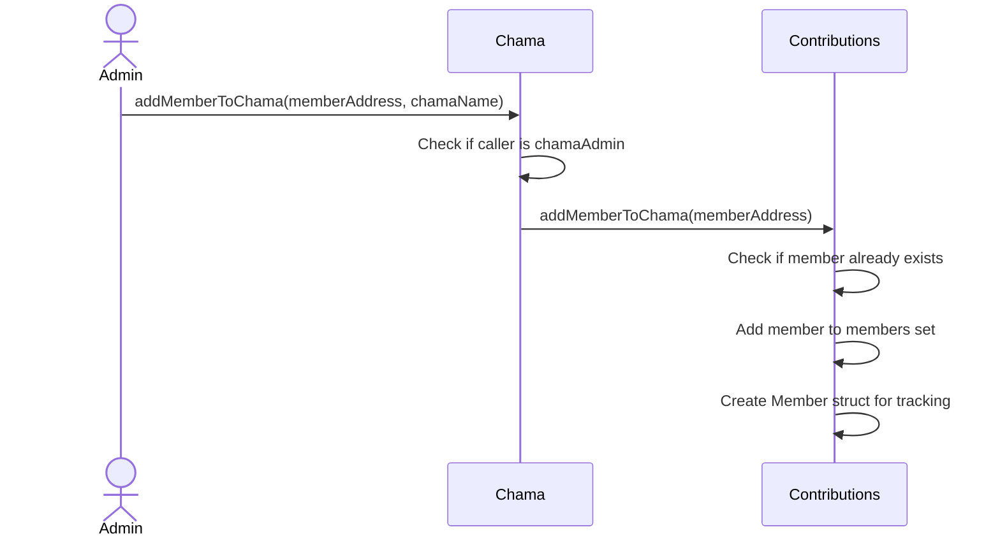
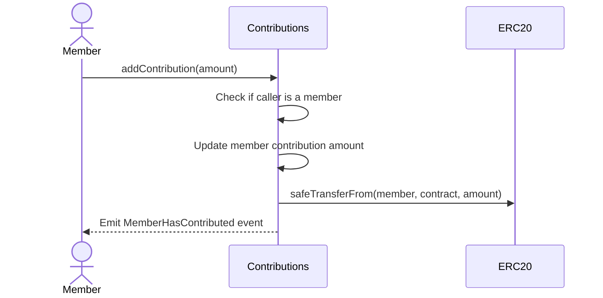
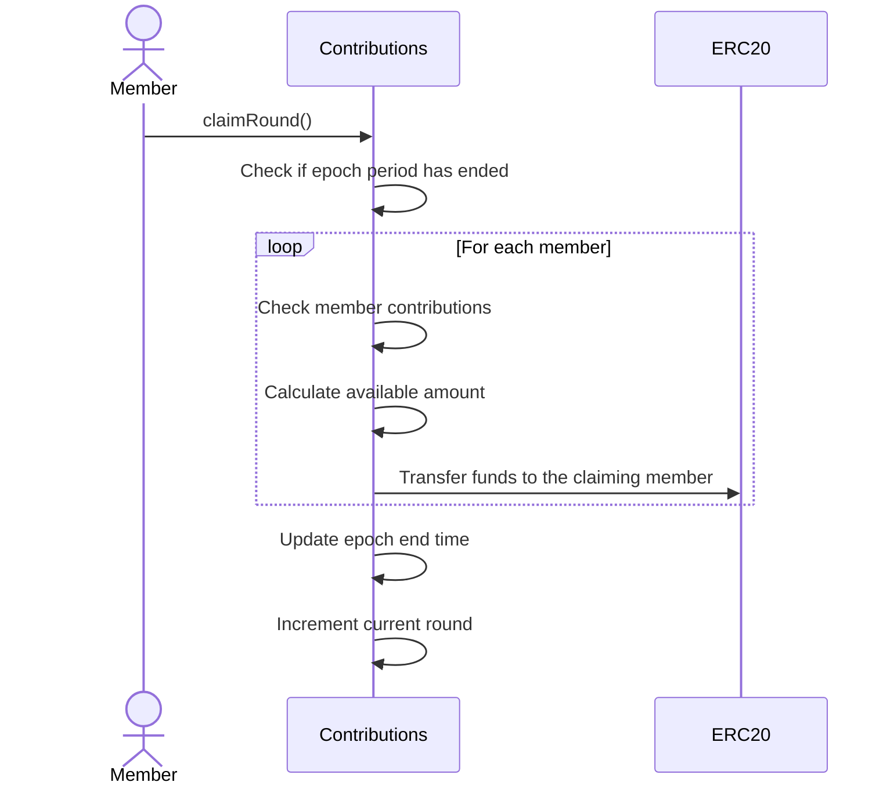

# ChamaDAO Contracts

A decentralized protocol that implements traditional community-based "Chama" savings groups on-chain.

## Overview

ChamaDAO is a blockchain protocol that digitizes traditional Chama savings groups – community-based financing systems common in Africa where members regularly contribute funds to a collective pool and take turns receiving the pooled amount. The protocol extends this concept with additional DeFi capabilities including decentralized governance, transparent fund management, and on-chain lending.

## 📋 Table of Contents

- Architecture
- Contract Relationships
- Key Features
- Development Setup
- Contract Documentation
  - Chama Factory
  - Contributions
  - Loans
- Function Workflows
- Development Guide
- Testing
- Deployment

## Architecture

The ChamaDAO protocol is built with a modular architecture:

```
           ┌───────────────┐
           │  Chama.sol    │
           │ (Factory)     │
           └───────┬───────┘
                   │ creates
                   ▼
┌───────────────────────────────┐
│      Contributions.sol        │
│  (Member & Round Management)  │
├───────────────────────────────┤
│           Loans.sol           │
│      (Lending Functions)      │
└───────────────────────────────┘
```

## Contract Relationships

The ChamaDAO system consists of three main contracts:

1. **Chama Contract** (Chama.sol): Factory contract that creates and manages Chama groups.
2. **Contributions Contract** (Contributions.sol): Manages member contributions, round processing, and inherits lending functionality.
3. **Loans Contract** (`Loans.sol`): Base contract that provides lending capabilities, inherited by Contributions.

## Key Features

- **Chama Group Creation**: Create named Chama groups with admin designation
- **Member Management**: Add or remove members from a Chama
- **Contribution Management**: Members can contribute funds to the Chama pool
- **Round Processing**: Automatic round management with epoch-based distribution
- **Lending Capabilities**: Members can request loans from the Chama pool
- **Role-Based Access**: Granular permissions using OpenZeppelin's AccessControl
- **Token Integration**: Support for ERC20 tokens as the contribution medium

## Development Setup

This project uses Foundry for Ethereum development.

### Prerequisites

- [Foundry](https://book.getfoundry.sh/getting-started/installation)

### Installation

1. Clone the repository

```bash
git clone https://github.com/yourusername/chamadao-contracts.git
cd chamadao-contracts
```

2. Install dependencies

```bash
forge install
```

3. Build the contracts

```bash
forge build
```

## Contract Documentation

### Chama Factory

`Chama.sol` - Factory contract for creating and managing Chama groups.

#### Key Functions

```solidity
function createChama(address _admin, string memory _name, uint256 _interestRate) external returns (address)
```

Creates a new Chama group with the specified admin, name, and interest rate. Returns the address of the deployed Contributions contract.

```solidity
function addMemberToChama(address _member, string memory _name) external onlyChamaAdmin(_name)
```

Adds a member to an existing Chama group. Can only be called by the Chama admin.

```solidity
function getChamaAddress(string memory _name) external view returns (address)
```

Returns the contract address for a given Chama name.

### Contributions

`Contributions.sol` - Manages member contributions, round claiming, and member management.

#### State Variables

- `address public factoryContract`: The factory contract that created this Contributions instance
- `address private chamaAdmin`: The admin of this Chama group
- `uint256 public epochPeriod`: Time period of each contribution round (default: 30 days)
- `uint256 public currentRound`: Current round number
- `EnumerableSet.AddressSet private members`: Set of members in this Chama

#### Key Functions

```solidity
function addContribution(uint256 _amount) external onlyRole(MEMBER_ROLE)
```

Allows a member to add a contribution to the Chama pool.

```solidity
function claimRound() external nonReentrant onlyRole(MEMBER_ROLE)
```

Allows a member to claim the current round for all members, distributing funds according to the Chama model. Can only be called after the epoch period has ended.

```solidity
function addMemberToChama(address _address) external onlyRole(CHAMA_ADMIN_ROLE)
```

Admin function to add a new member to the Chama.

```solidity
function removeMemberFromChama(address _member) external onlyRole(CHAMA_ADMIN_ROLE)
```

Admin function to remove a member from the Chama. Member must have zero balance.

```solidity
function changeContributionToken(address _token) external onlyRole(CHAMA_ADMIN_ROLE)
```

Changes the token used for contributions. The contract balance must be zero.

### Loans

`Loans.sol` - Base contract that provides lending functionality.

This contract (not fully visible in the provided code snippets) appears to handle loan creation, approval, and repayment within the Chama ecosystem. It tracks frozen contribution amounts for outstanding loans.

## Function Workflows

### Creating a New Chama Group



### Adding a Member to Chama



### Member Contribution Flow



### Round Claiming Flow



## Development Guide

### Adding a New Feature

1. Identify which contract should implement the feature
2. Implement the new functionality with proper access controls
3. Add relevant tests to verify functionality
4. Update documentation to reflect changes

### Best Practices

- Always include events for important state changes
- Use OpenZeppelin's SafeERC20 for token transfers
- Check for zero addresses in public functions
- Implement nonReentrant modifiers for external calls
- Keep functions simple and follow the checks-effects-interactions pattern

## Testing

ChamaDAO uses Foundry's testing framework. Tests are located in test directory.

Run all tests:

```bash
forge test
```

Run specific test:

```bash
forge test --match-contract ChamaTest -vvv
```

Run with gas reporting:

```bash
forge test --gas-report
```

### Test Structure

- unit: Unit tests for individual contracts
- mocks: Mock contracts for testing

## Deployment

The project includes deployment scripts for various networks. To deploy to a network:

```bash
forge script script/DeployChama.s.sol:DeployChamaScript --rpc-url <your_rpc_url> --private-key <your_private_key>
```

### Contract Verification

After deployment, you can verify contracts on Etherscan:

```bash
forge verify-contract <deployed_address> src/Chama.sol:Chama --etherscan-api-key <your_api_key> --chain <chain_id>
```

## DAO Governance

According to the ChamaDAO Whitepaper, governance is structured with the following components:

1. **DAO Treasury** - Managed collectively by the community
2. **Membership Tiers** - Different levels of participation and voting rights
3. **Proposal System** - Formal mechanism for suggesting and approving changes
4. **Voting Mechanism** - Token-weighted or quadratic voting for decision making

## Security Considerations

- The protocol uses role-based access control to enforce permissions
- Funds cannot be withdrawn without proper round processing
- SafeERC20 is used to prevent common token handling vulnerabilities
- Members cannot be removed if they have a non-zero balance
- Token changes require zero balance to prevent fund loss

## Additional Resources

- [Foundry Documentation](https://book.getfoundry.sh/)
- ChamaDAO Whitepaper
- [OpenZeppelin Documentation](https://docs.openzeppelin.com/)

## License

This project is licensed under the MIT License.
