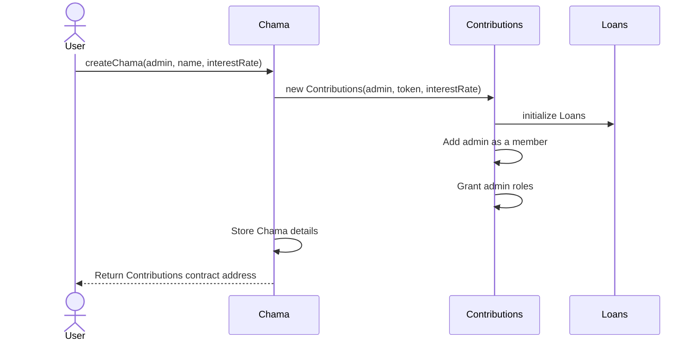
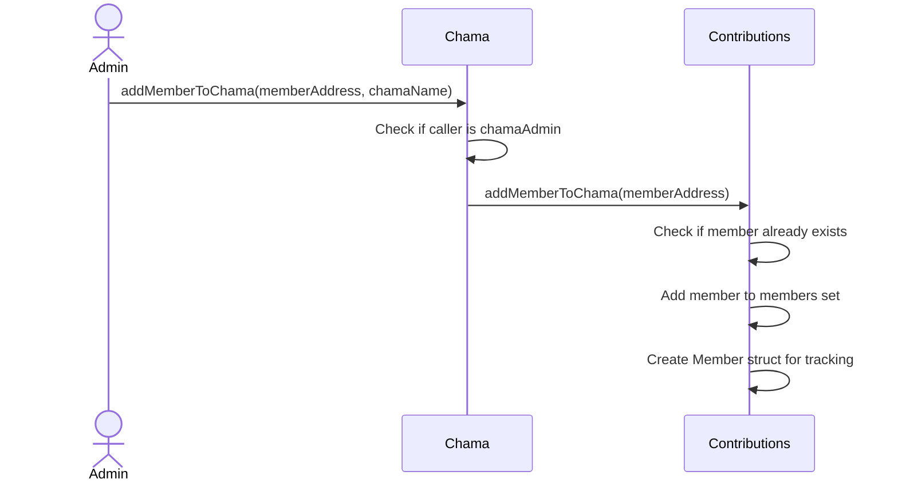
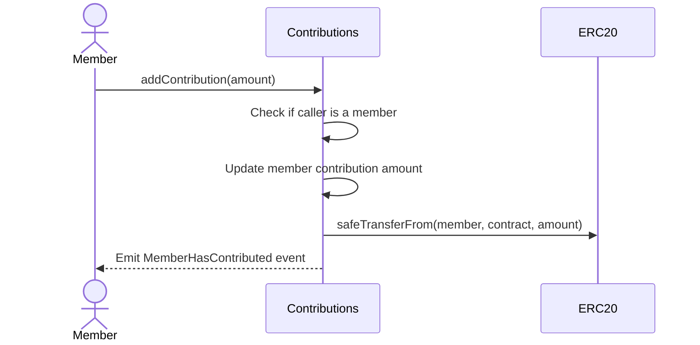
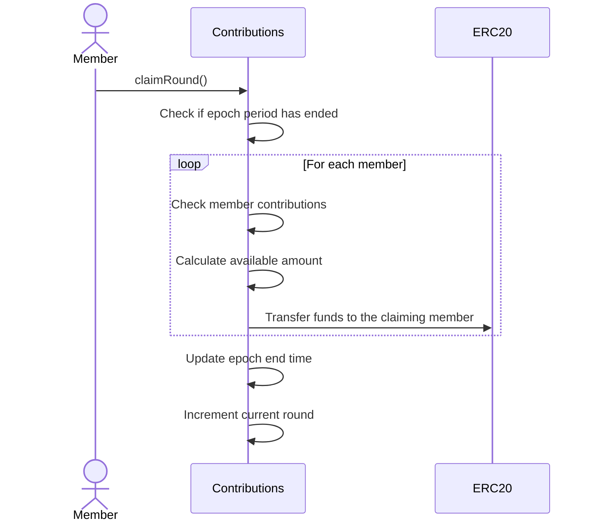
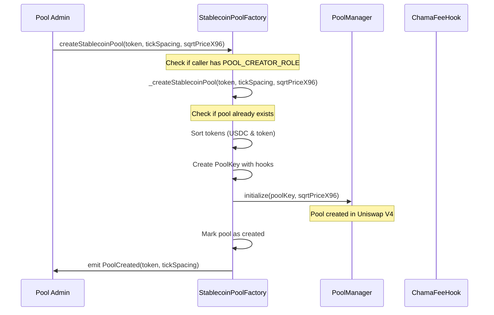
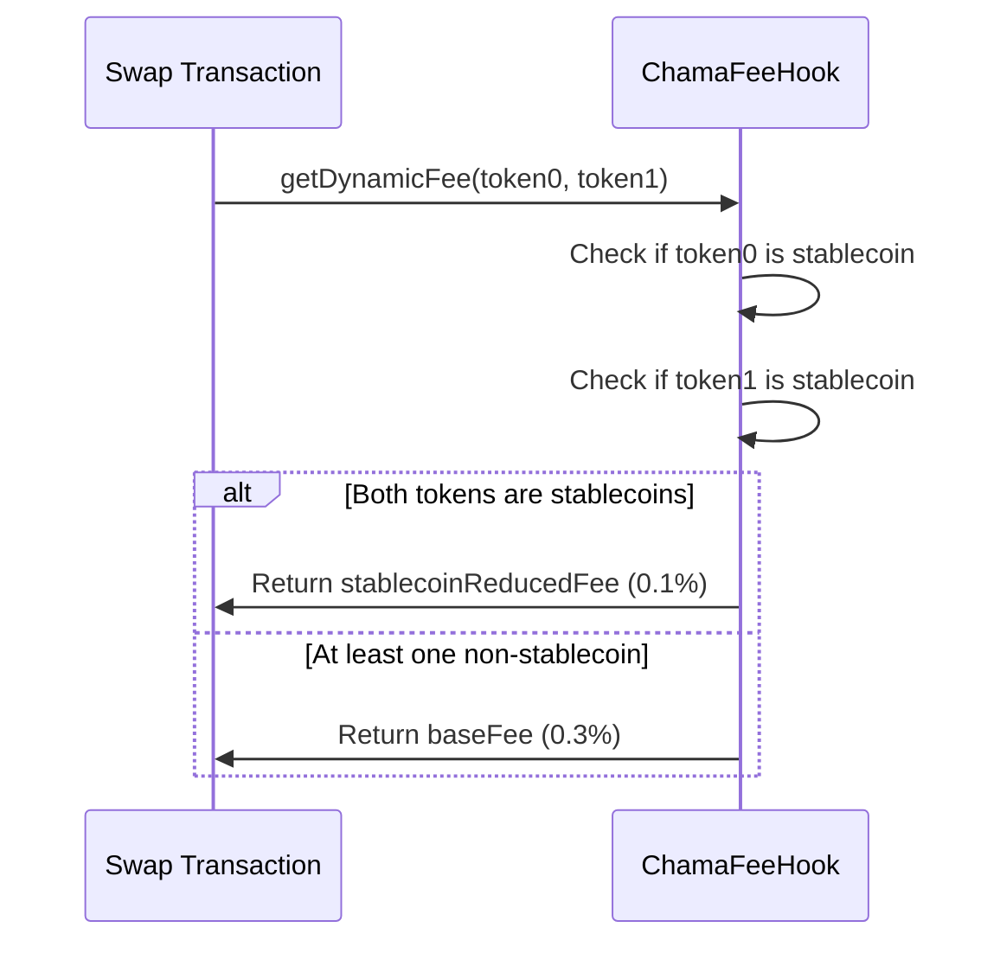
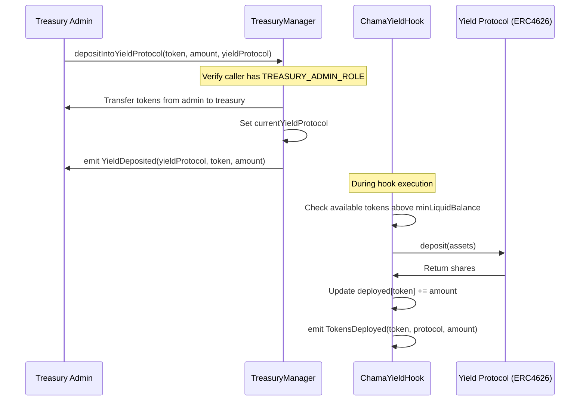
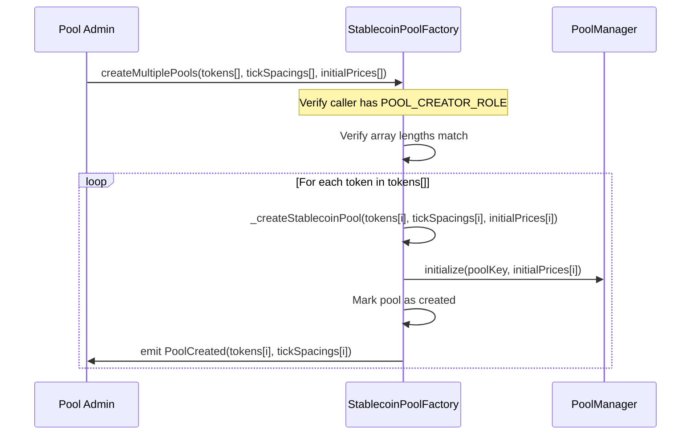
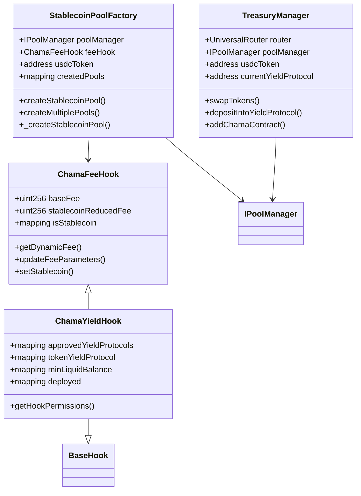

# ChamaDAO Contracts

**Bringing Traditional Community Savings to the Blockchain**

ChamaDAO is a decentralized protocol that digitizes traditional African "Chama" savings groups—community-based systems where members pool funds and rotate payouts. By leveraging blockchain technology, ChamaDAO enhances this model with transparent fund management, decentralized governance, and on-chain lending, making it secure, efficient, and globally accessible.

## 📋️ Table of Contents

- [Overview](#overview)
- [Architecture](#architecture)
- [Contract Relationships](#contract-relationships)
- [Key Features](#key-features)
- [Development Setup](#development-setup)
- [Contract Documentation](#contract-documentation)
  - [Chama Factory](#chama-factory)
  - [Contributions](#contributions)
  - [Loans](#loans)
- [Function Workflows](#function-workflows)
- [Development Guide](#development-guide)
- [Testing](#testing)
- [Deployment](#deployment)
- [DAO Governance](#dao-governance)
- [Security Considerations](#security-considerations)
- [Additional Resources](#additional-resources)
- [Uniswap V4 Integration to ChamaDao Technical Documentation](#uniswap-v4-integration-to-chamadao-technical-documentation)
- [Deployed Contract Addresses](#deployed-contract-addresses)

## Overview

ChamaDAO is a blockchain protocol that digitizes traditional Chama savings groups – community-based financing systems common in Africa where members regularly contribute funds to a collective pool and take turns receiving the pooled amount. The protocol extends this concept with additional DeFi capabilities including decentralized governance, transparent fund management, and on-chain lending.

## Architecture

The ChamaDAO protocol is built with a modular architecture:

```
           ┌───────────────┐
           │  Chama.sol    │
           │ (Factory)     │
           └───────┬───────┘
                   │ creates
                   ▼
┌───────────────────────────────┐
│      Contributions.sol        │
│  (Member & Round Management)  │
├───────────────────────────────┤
│           Loans.sol           │
│      (Lending Functions)      │
└───────────────────────────────┘
```

## Contract Relationships

The ChamaDAO system consists of three main contracts:

1. **Chama Contract** (Chama.sol): Factory contract that creates and manages Chama groups.
2. **Contributions Contract** (Contributions.sol): Manages member contributions, round processing, and inherits lending functionality.
3. **Loans Contract** (`Loans.sol`): Base contract that provides lending capabilities, inherited by Contributions.

## Key Features

- **Chama Group Creation**: Create named Chama groups with admin designation
- **Member Management**: Add or remove members from a Chama
- **Contribution Management**: Members can contribute funds to the Chama pool
- **Round Processing**: Automatic round management with epoch-based distribution
- **Lending Capabilities**: Members can request loans from the Chama pool
- **Role-Based Access**: Granular permissions using OpenZeppelin's AccessControl
- **Token Integration**: Support for ERC20 tokens as the contribution medium

## Development Setup

This project uses Foundry for Ethereum development.

### Prerequisites

- [Foundry](https://book.getfoundry.sh/getting-started/installation)

### Installation

1. Clone the repository

```bash
git clone https://github.com/yourusername/chamadao-contracts.git
cd chamadao-contracts
```

2. Install dependencies

```bash
forge install
```

3. Build the contracts

```bash
forge build
```

## Contract Documentation

### Chama Factory

`Chama.sol` - Factory contract for creating and managing Chama groups.

#### Key Functions

```solidity
function createChama(address _admin, string memory _name, uint256 _interestRate) external returns (address)
```

Creates a new Chama group with the specified admin, name, and interest rate. Returns the address of the deployed Contributions contract.

```solidity
function addMemberToChama(address _member, string memory _name) external onlyChamaAdmin(_name)
```

Adds a member to an existing Chama group. Can only be called by the Chama admin.

```solidity
function getChamaAddress(string memory _name) external view returns (address)
```

Returns the contract address for a given Chama name.

### Contributions

`Contributions.sol` - Manages member contributions, round claiming, and member management.

#### State Variables

- `address public factoryContract`: The factory contract that created this Contributions instance
- `address private chamaAdmin`: The admin of this Chama group
- `uint256 public epochPeriod`: Time period of each contribution round (default: 30 days)
- `uint256 public currentRound`: Current round number
- `EnumerableSet.AddressSet private members`: Set of members in this Chama

#### Key Functions

```solidity
function addContribution(uint256 _amount) external onlyRole(MEMBER_ROLE)
```

Allows a member to add a contribution to the Chama pool.

```solidity
function claimRound() external nonReentrant onlyRole(MEMBER_ROLE)
```

Allows a member to claim the current round for all members, distributing funds according to the Chama model. Can only be called after the epoch period has ended.

```solidity
function addMemberToChama(address _address) external onlyRole(CHAMA_ADMIN_ROLE)
```

Admin function to add a new member to the Chama.

```solidity
function removeMemberFromChama(address _member) external onlyRole(CHAMA_ADMIN_ROLE)
```

Admin function to remove a member from the Chama. Member must have zero balance.

```solidity
function changeContributionToken(address _token) external onlyRole(CHAMA_ADMIN_ROLE)
```

Changes the token used for contributions. The contract balance must be zero.

### Loans

`Loans.sol` - Base contract that provides lending functionality.

This contract (not fully visible in the provided code snippets) appears to handle loan creation, approval, and repayment within the Chama ecosystem. It tracks frozen contribution amounts for outstanding loans.

## Function Workflows

### Creating a New Chama Group



### Adding a Member to Chama



### Member Contribution Flow



### Round Claiming Flow



## Development Guide

### Adding a New Feature

1. Identify which contract should implement the feature
2. Implement the new functionality with proper access controls
3. Add relevant tests to verify functionality
4. Update documentation to reflect changes

### Best Practices

- Always include events for important state changes
- Use OpenZeppelin's SafeERC20 for token transfers
- Check for zero addresses in public functions
- Implement nonReentrant modifiers for external calls
- Keep functions simple and follow the checks-effects-interactions pattern

## Testing

ChamaDAO uses Foundry's testing framework. Tests are located in test directory.

Run all tests:

```bash
forge test
```

Run specific test:

```bash
forge test --match-contract ChamaTest -vvv
```

Run with gas reporting:

```bash
forge test --gas-report
```

### Test Structure

- unit: Unit tests for individual contracts
- mocks: Mock contracts for testing

## Deployment

The project includes deployment scripts for various networks. To deploy to a network:

```bash
forge script script/DeployChama.s.sol:DeployChamaScript --rpc-url <your_rpc_url> --private-key <your_private_key>
```

### Contract Verification

After deployment, you can verify contracts on Etherscan:

```bash
forge verify-contract <deployed_address> src/Chama.sol:Chama --etherscan-api-key <your_api_key> --chain <chain_id>
```

## DAO Governance

According to the ChamaDAO Whitepaper, governance is structured with the following components:

1. **DAO Treasury** - Managed collectively by the community
2. **Membership Tiers** - Different levels of participation and voting rights
3. **Proposal System** - Formal mechanism for suggesting and approving changes
4. **Voting Mechanism** - Token-weighted or quadratic voting for decision making

## Security Considerations

- **Access Control**: All administrative functions are protected by role-based access control
- Funds cannot be withdrawn without proper round processing
- SafeERC20 is used to prevent common token handling vulnerabilities
- Members cannot be removed if they have a non-zero balance
- Token changes require zero balance to prevent fund loss
- Fee Limitations: Maximum fee is capped at 1% to prevent excessive charges
- **Duplicate Prevention**: System prevents creating duplicate pools for the same token pairs
- **Array Validation**: Multiple pool creation validates input array lengths to prevent errors

## Additional Resources

- [Foundry Documentation](https://book.getfoundry.sh/)
- ChamaDAO Whitepaper
- [OpenZeppelin Documentation](https://docs.openzeppelin.com/)

## License

This project is licensed under the MIT License.

# Uniswap V4 Integration to ChamaDao Technical Documentation

## Overview

The Uniswap V4 integration module provides a comprehensive set of contracts for deploying, managing, and optimizing liquidity pools for Chamas with a focus on stablecoins. The system incorporates custom fee structures, yield generation strategies, and treasury management capabilities.

## Components

### 1. ChamaFeeHook

A fee management contract that provides dynamic fee calculation based on token pairs.

**Key Features**

- **Dynamic Fee Structure**: Base fee (0.3%) and reduced fee (0.1%) for stablecoin-to-stablecoin swaps
- **Stablecoin Registry**: Maintains a whitelist of stablecoin addresses
- **Per-Pool Custom Fees**: Supports custom fee configurations for specific pools

**Key Functions**

- `getDynamicFee(address token0, address token1)`: Calculates the appropriate fee tier based on token types
- `updateFeeParameters(uint256 _baseFee, uint256 _stablecoinReducedFee)`: Updates the global fee parameters
- `setStablecoin(address token, bool status)`: Adds or removes tokens from the stablecoin registry

### 2. ChamaYieldHook

Extends ChamaFeeHook to provide yield generation capabilities by integrating with external lending protocols.

**Key Features**

- **Yield Protocol Integration**: Connects with ERC4626-compliant lending protocols, For now we chose Morpho Vaults
- **Liquidity Management**: Maintains minimum liquidity for pool operations while deploying excess for yield
- **Protocol Registry**: Tracks approved yield protocols for each token

**Key Functions**

- `getHookPermissions()`: Defines the hook's permissions within the Uniswap V4 framework
- Tracking deployed assets and minimum liquid balances per token

### 3. StablecoinPoolFactory

Creates and initializes pools optimized for stablecoin trading.

**Key Features**

- **Role-Based Access Control**: Restricts pool creation to authorized addresses
- **USDC-Based Pairs**: Specializes in creating pairs with USDC as one of the tokens
- **Batch Creation**: Supports creating multiple pools in a single transaction

**Key Functions**

- `createStablecoinPool(address token, int24 tickSpacing, uint160 sqrtPriceX96)`: Creates a new USDC-token pair
- `createMultiplePools(address[] tokens, int24[] tickSpacings, uint160[] initialPrices)`: Batch creates multiple pools
- `_createStablecoinPool(address token, int24 tickSpacing, uint160 sqrtPriceX96)`: Internal implementation for pool creation

### 4. TreasuryManager

Manages treasury operations, including swaps, liquidity provision, and yield strategy deployments.

**Key Features**

- **Role-Based Access Control**: Separate roles for treasury administration and Chama operations
- **Swap Functionality**: Executes token swaps through Uniswap
- **Yield Management**: Deposits funds into yield-generating protocols
- **Fee Collection**: Collects and manages protocol fees

**Key Functions**

- `swapTokens()`: Executes token swaps
- `depositIntoYieldProtocol(address token, uint256 amount, address yieldProtocol)`: Moves treasury assets to yield-generating protocols
- `addChamaContract(address chamaContract)`: Grants `CHAMA_ROLE` to a contract

## System Workflows

**Pool Creation Workflow**



**Dynamic Fee Calculation**



**Yield Generation Workflow**



**Multi-Pool Creation**



## Architecture Diagram



## Intergration Guide

Setting Up a New Pool

1. Deploy `ChamaFeeHook` to establish the fee structure
2. Deploy `StablecoinPoolFactory` with references to:
   - Uniswap V4 PoolManager
   - Position Manager
   - ChamaFeeHook
   - USDC token address
   - Admin address
3. Grant the `POOL_CREATOR_ROLE` to authorized addresses
4. Call `createStablecoinPool()` or `createMultiplePools()` to create new pools

Enabling Yield Generation

1. Deploy `ChamaYieldHook` with reference to the PoolManager
2. Configure approved yield protocols and minimum liquidity reserves
3. Deploy `TreasuryManager` with necessary references
4. Use `depositIntoYieldProtocol()` to start generating yield on treasury assets

## Conclusion

The Uniswap V4 integration module is meant to be incorporated into the ChamaDAO contracts but that is yet to happen because there are numerous fine tuning yet to happen, after which we will deploy it to the base network. When that is done, it will allow chamas to stake their idle usdc and earn yield on it. The module is designed to be modular and extensible, allowing for future enhancements and integrations with other DeFi protocols.

Chamadao contracts themselves are also almost done, only pending afew minor tweaks, we've however deployed the current version on Base for testing, the addresses which can be found at the Contract addresses section.

## Deployed Contract Addresses

- `Chama.sol`: `0xC2f4fc5416d96ac447388EAD98c8eeDb45d6Ba82`

For contibutions contract, we deployed two of them while doing the testing

- `Contributions.sol` : `0x34f09e28bc8ED9007EDEd64ceD1786d4c41115b9`
  `0x2FA66c826a61308731a98C53EC24667660811fB9`
- `testUsdc`: `0xe274A1b0C81988526586d8209D820fe30832DdE6`
